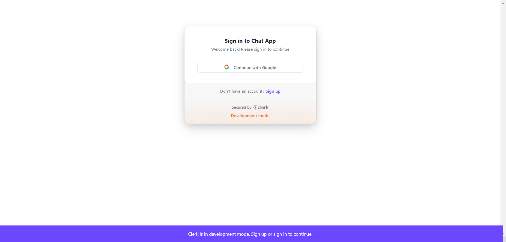
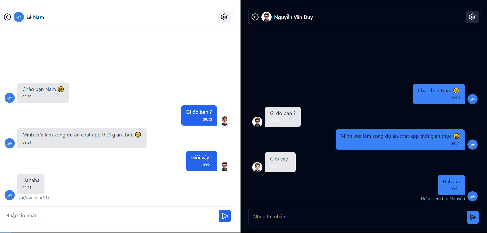

# Real-Time Chat App

This is a **real-time chat application** built using modern web technologies like **Next.js**, **React**, and **ShadcnUI**, designed to provide seamless real-time messaging functionality with a clean and responsive UI.

## Features
- Real-time messaging and data synchronization
- User authentication with Clerk integration
- Form validation using React Hook Form and Zod
- Responsive design using Tailwind CSS and custom themes
- Backend powered by Convex.dev for real-time data updates
- Tooltips, dialogs, dropdowns, and other interactive UI components using Radix UI

## Technologies Used
- **Next.js**: Fast and scalable React framework for building web applications
- **React**: JavaScript library for building user interfaces
- **ShadcnUI**: Modern and customizable UI components
- **Tailwind CSS**: Utility-first CSS framework
- **Convex.dev**: Real-time backend for synchronization
- **Clerk**: Authentication service for secure user login and management
- **Radix UI**: UI primitives for building accessible and customizable components
- **Zod**: TypeScript-first schema declaration and validation library
- **Sonner**: Toast notification library

## Screenshots


*Login Page of the Chat App*


*Real-time Chat Interface*

## Installation

To get started with the project, follow these steps:

1. Clone the repository:
   
   ```bash
   git clone https://github.com/nguyenvanduydev001/chat-app.git 
   ```
2. Install the dependencies:
   
   ```bash
   npm install
   ```
3. Start the development server:
   
   ```bash
   npm run dev 
   ```
4. Start the Convex backend:
   
   ```bash
   npx convex dev
   ```

## Demo
Check out the live demo of the project: [Link to demo](https://demo1-chat-app.vercel.app/)

---

*Built with ❤️ by [Nguyễn Văn Duy]*